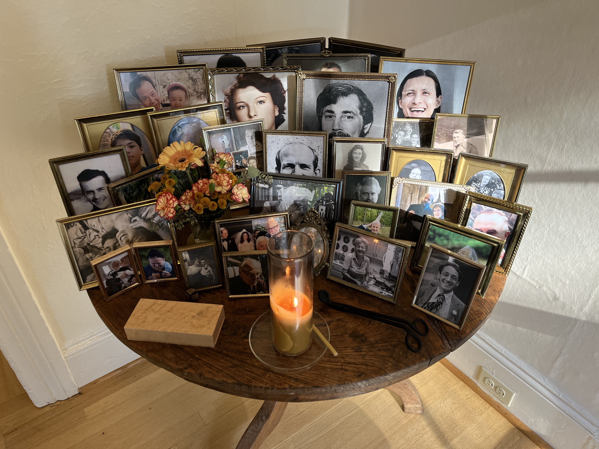

# 🕯️ Ancestor Table @ West Co.

**We care for an ancestor table to stay rooted in what matters.**

Our ancestors have a treasured place in our physical space and daily routine. These are our grandparents, uncles, teachers, mentors, children, exemplars, parents, and saints. They greet us every day, reminding us of the many lineages we share, of the stories they have told us and the lessons they would have us remember.

Our ancestor table is just inside the front door of our office. The first person who comes in each day lights the vigil candle, which burns until the last person to leave puts it out. We want the table to feel delightful and important, so we take special care with this table, the candle, the frames, and the matches. 

When a new person joins our team we ask them to choose someone to add. The first time our new colleague visits the office, we take a few minutes for them to tell us about who their person is and why they matter.

---

[← Back to Practices](README.md) | [Home](../README.md)
